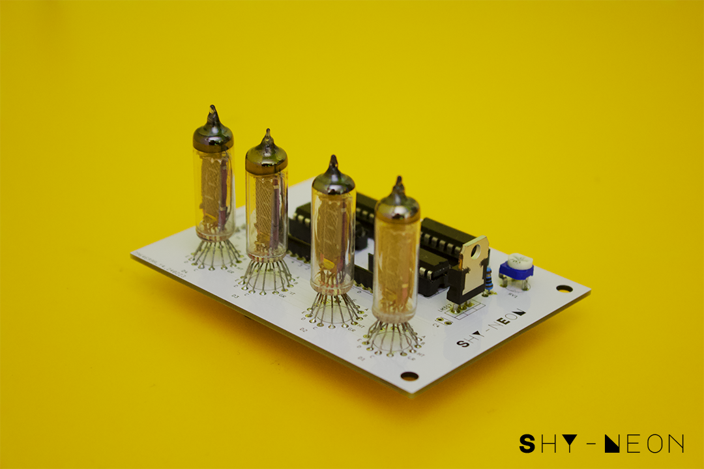
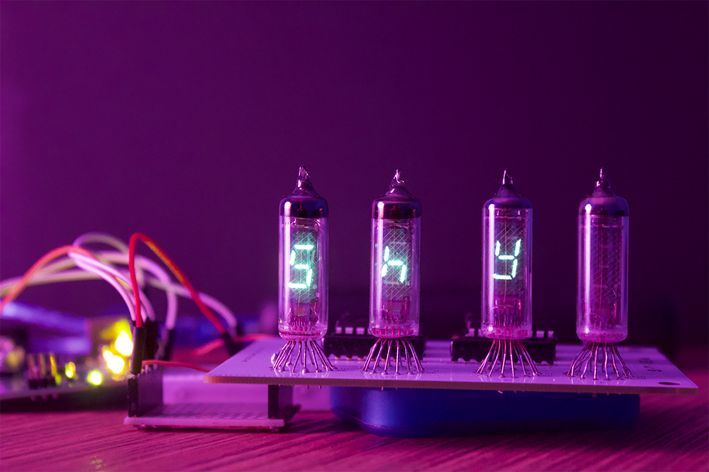

# vfdRevival

Although any ICs for driving VFD displays exist, they are generally out of production, or even out of stock. Many can be found on Ebay but usually they are New Old Stock soviet ICs. The main goal of thi froject is to drive drive those tubes with jellybeans ICs which can be easily sourced at reasonables proces. The repo proveide, an example sketch, schematics and pcb layouts.
