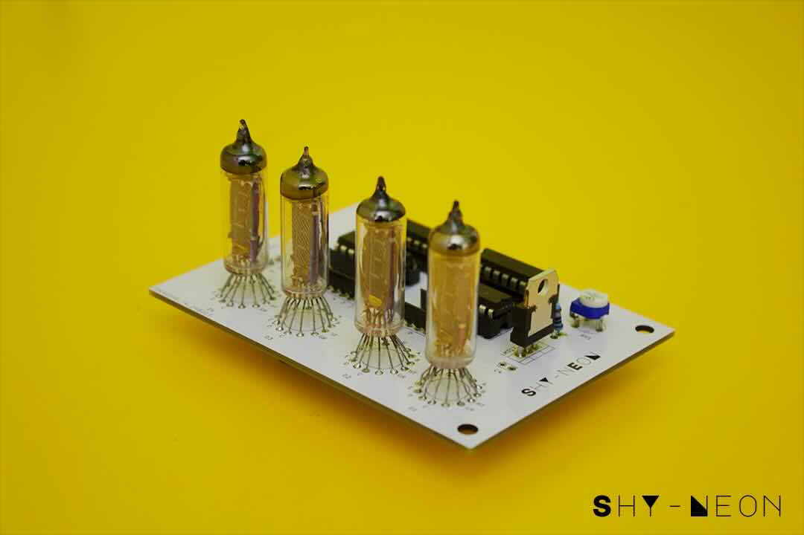
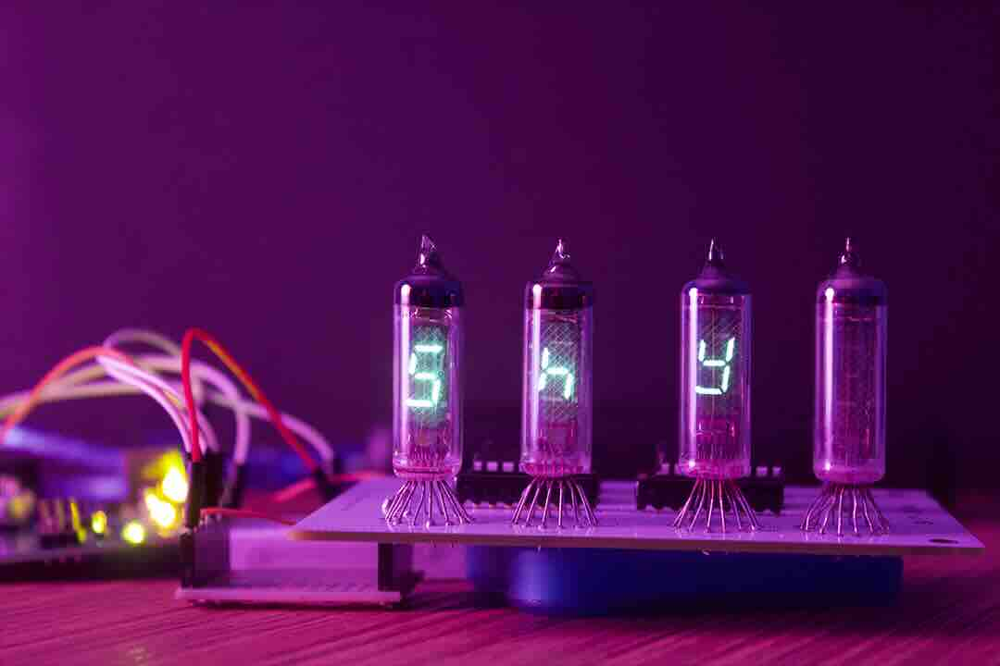

# VFD-Revival

  
  

 
Although many ICs for driving VFD displays exist, they are generally out of production, or even out of stock. Many can be found on Ebay but usually they are very expensive and New Old Stock soviet ICs. The main goal of this project is to drive those tubes with jellybeans ICs, which can be easily sourced at reasonables proces. The repo proveides an example sketch, schematics and pcb layouts.
